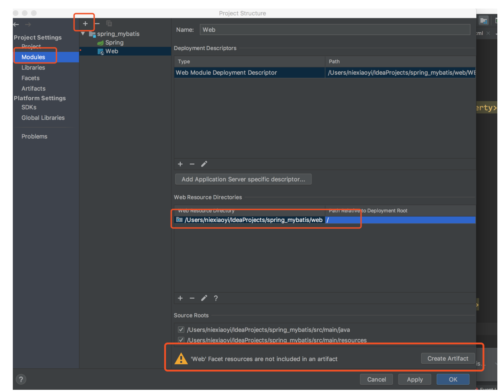
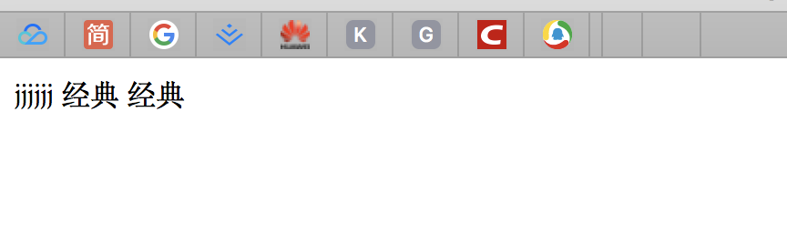

# spring_mybatis
spring+mybatis +springmvc


在spring_mybatis的基础上继续集成springmvc

 https://github.com/Fengxiangmei/spring_mybatis

1.在pom.xml中添加如下内容,增加spring-web,和spring-webmvc依赖：

```xml
  <dependency>
      <groupId>org.springframework</groupId>
      <artifactId>spring-web</artifactId>
      <version>${spring.version}</version>
    </dependency>
    <dependency>
      <groupId>org.springframework</groupId>
      <artifactId>spring-webmvc</artifactId>
      <version>${spring.version}</version>
    </dependency>
    <!-- https://mvnrepository.com/artifact/javax.servlet/jstl -->
     <dependency>
      <groupId>javax.servlet</groupId>
      <artifactId>jstl</artifactId>
      <version>1.2</version>
    </dependency>
    <!-- https://mvnrepository.com/artifact/javax.servlet/javax.servlet-api -->
    <dependency>
      <groupId>javax.servlet</groupId>
      <artifactId>javax.servlet-api</artifactId>
      <version>3.1.0</version>
      <scope>provided</scope>
    </dependency>


    
```

 2.在main文件夹下新建webapp文件夹,并新建WEB-INF，做如下设置。




3.在WEB-INF下新建web.xml文件，添加DispatcherServlet前端控制器，加载Spring容器配置，设置编码过滤器：

```xml
<?xml version="1.0" encoding="UTF-8"?>
<!--xmlns="http://xmlns.jcp.org/xml/ns/javaee"-->
<web-app 
         xmlns:xsi="http://www.w3.org/2001/XMLSchema-instance"
         xsi:schemaLocation="http://xmlns.jcp.org/xml/ns/javaee http://xmlns.jcp.org/xml/ns/javaee/web-app_3_1.xsd"
         version="3.1">
  <!-- 加载Spring容器配置 spring 提供ServletContextListener 的一个实现类ContextLoaderListener ，该类可以作为listener 使用，
  它会在创建时自动查找WEB-INF/下的applicationContext.xml 文件。因此，如果只有一个配置文件，并且文件名为applicationContext.xml ，则只需在web.xml文件中增加如下代码即可:-->
  <listener>
    <listener-class>org.springframework.web.context.ContextLoaderListener</listener-class>
  </listener>
  <!-- Spring容器加载所有的配置文件的路径
  contextConfigLocation 参数的<param-value>定义了要装入的 Spring 配置文件 -->
  <context-param>
    <param-name>contextConfigLocation</param-name>
    <param-value>classpath*:applicationContext.xml</param-value>
  </context-param>
  <!-- 配置SpringMVC核心控制器,将所有的请求(除了刚刚Spring MVC中的静态资源请求)都交给Spring MVC -->
  <servlet>
    <servlet-name>springMvc</servlet-name>
    <servlet-class>org.springframework.web.servlet.DispatcherServlet</servlet-class>
    <init-param>
      <param-name>contextConfigLocation</param-name>
      <param-value>classpath*:applicationContext-mvc.xml</param-value>
    </init-param>
    <!--用来标记是否在项目启动时就加在此Servlet,0或正数表示容器在应用启动时就加载这个Servlet,
    当是一个负数时或者没有指定时，则指示容器在该servlet被选择时才加载.正数值越小启动优先值越高  -->
    <load-on-startup>1</load-on-startup>
  </servlet>
  <!--为DispatcherServlet建立映射-->
  <servlet-mapping>
    <servlet-name>springMvc</servlet-name>
    <!-- 拦截所有请求,千万注意是(/)而不是(/*) -->
    <url-pattern>/</url-pattern>
  </servlet-mapping>

  <!-- 设置编码过滤器 -->
  <filter>
    <filter-name>encodingFilter</filter-name>
    <filter-class>org.springframework.web.filter.CharacterEncodingFilter</filter-class>
    <init-param>
      <param-name>encoding</param-name>
      <param-value>UTF-8</param-value>
    </init-param>
    <init-param>
      <param-name>forceEncoding</param-name>
      <param-value>true</param-value>
    </init-param>
  </filter>

  <filter-mapping>
    <filter-name>encodingFilter</filter-name>
    <url-pattern>/*</url-pattern>
  </filter-mapping>
</web-app>
```

4.在resources文件夹下新建applicationContext-mvc.xml文件

```xml
<?xml version="1.0" encoding="UTF-8"?>
<beans xmlns="http://www.springframework.org/schema/beans"
       xmlns:xsi="http://www.w3.org/2001/XMLSchema-instance"
       xmlns:context="http://www.springframework.org/schema/context"
       xmlns:mvc="http://www.springframework.org/schema/mvc"
       xsi:schemaLocation="http://www.springframework.org/schema/beans http://www.springframework.org/schema/beans/spring-beans.xsd http://www.springframework.org/schema/context http://www.springframework.org/schema/context/spring-context.xsd http://www.springframework.org/schema/mvc http://www.springframework.org/schema/mvc/spring-mvc.xsd">

    <!-- 告知Spring，我们启用注解驱动 -->
    <mvc:annotation-driven/>
    <!-- org.springframework.web.servlet.resource.DefaultServletHttpRequestHandler，
    它会像一个检查员，对进入DispatcherServlet的URL进行筛查，如果发现是静态资源的请求，
    就将该请求转由Web应用服务器默认的Servlet处理，如果不是静态资源的请求，才由DispatcherServlet继续处理。 -->
    <mvc:default-servlet-handler/>
    <!-- 指定要扫描的包的位置 -->
    <context:component-scan base-package="com.fxm.study.controller" />
    <!-- 对静态资源文件的访问,因为Spring MVC会拦截所有请求,导致jsp页面中对js和CSS的引用也被拦截,配置后可以把对资源的请求交给项目的
    默认拦截器而不是Spring MVC-->
    <mvc:resources mapping="/static/**" location="/WEB-INF/static/" />

    <!-- 配置Spring MVC的视图解析器 -->
    <bean class="org.springframework.web.servlet.view.InternalResourceViewResolver">
        <!-- 有时我们需要访问JSP页面,可理解为在控制器controller的返回值加前缀和后缀,变成一个可用的URL地址 -->
        <property name="prefix" value="/WEB-INF/jsp/"/>
        <property name="suffix" value=".jsp"/>
    </bean>
</beans>
```

5.在WEB-INF文件夹新建static（放静态资源），jsp（放逻辑视图），同时在jsp文件夹下新建index.js文件；

```jsp
<%--
  Created by IntelliJ IDEA.
  User: niexiaoyi
  Date: 2019-09-02
  Time: 20:55
  To change this template use File | Settings | File Templates.
--%>

<%@ page contentType="text/html;charset=UTF-8" language="java" isELIgnored="false" %>
<%@taglib prefix="c" uri="http://java.sun.com/jsp/jstl/core" %>
<html>
<head>
    <title>Title</title>
</head>
<body>
jjjjjj
${username}
<c:forEach items="${student}" var="s">
    <c:out value="${s.sname}"/>
</c:forEach>
</body>
</html>


```

5.在java文件夹先新建controller包，并在contoller包下新建IndexContrller.java

```java
package com.fxm.study.controller;

import com.fxm.study.pojo.Student;
import com.fxm.study.service.StudentService;
import com.sun.tools.internal.xjc.ModelLoader;
import org.springframework.beans.factory.annotation.Autowired;
import org.springframework.stereotype.Controller;
import org.springframework.ui.Model;
import org.springframework.web.bind.annotation.RequestMapping;

import java.util.ArrayList;
import java.util.HashMap;
import java.util.List;
import java.util.Map;

@Controller
public class IndexController {
    @Autowired
    StudentService studentService;
  //访问链接http://localhost:8080/spring_mybatis_Web_exploded/index?i=10
   @RequestMapping("/index")
    public String index(Model model,int i){
      Student student = studentService.selectByPrimaryKey(i);
      if(null!=student){
          System.out.println(student.getSname());
          model.addAttribute("username",student.getSname());
          Map<String, List<Student>> studentMap = new HashMap<>();
          List<Student> students = new ArrayList<Student>();
          students.add(student);
          studentMap.put("student",students);
          model.addAllAttributes(studentMap);
      }
      return "index";
   }
}


```

6.运行测试：




​    

 

​       
